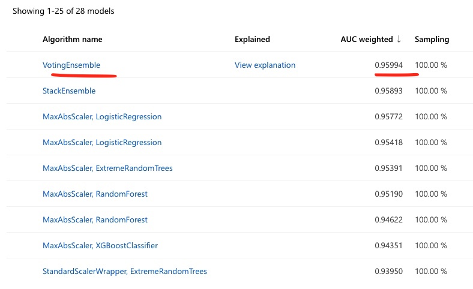
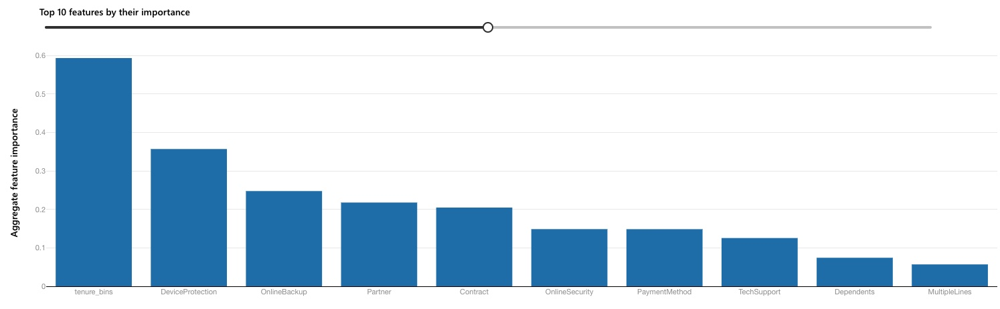
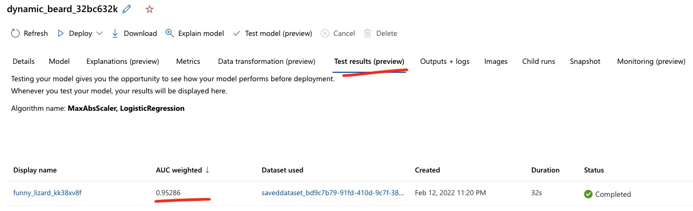
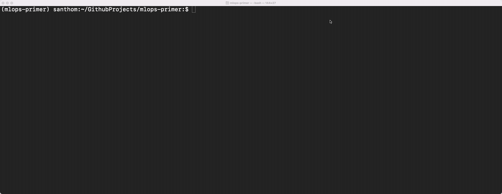

# Concept Drift
Six months after the initial deployment of the model, there are signs that the model is degrading in
performance (again). On the bright side, this seems to be largely because the churn rate is starting to
decline in response to some of the marketing initiatives. Given the MLOps team is looking to maintain an
accurate model, an early alert (enabled through App Insights) has shown continual decline in the model's
ability to predict accurately. 

This is an example of **concept drift** - where the fundamental relationship between the input(s), or the
attributes and the predicted target variable (i.e. churn) is undergoing shifts. Similar to data drift, this
can be detected through basic statistics comparing the new target distribution vs. the baseline target
distribution or through more sophisticated statistical tests, like the KS test.

As before, the MLOps team will retrain the model, and evaluate the new model on the fresh batch of
data. If it outperforms the existing model, it will be promoted as the new model to the production system.

## Necessary Steps
1. **Artifact the new batch of data.** The new batch of data (the `Concept Dataset`) needs to be registered in
   the workspace. This dataset contains the same attributes though the relationship between the input(s) and
   the target variable has changed. (For example, in the original dataset, the churn was ~26% of the entire
   population while in the new batch of data, it is approximately a tenth of that.)
2. **Train the model.** Off the `Concept Dataset`, a new training run with AutoML can be triggered to find the best model. The
   AutoML configuration is similar to the retraining step a few months before.
   	- Results of the training process yield the following results: 
	- Post-training, the feature attribution is shown below:  
	- Test accuracy is consistent with the trained model, as seen:  

## Comparing the Baseline Model
To see how much the new dataset has degraded on the baseline model, we can compare the `Concept Dataset` on
the original `baseline-model-endpoint`. This yields an error rate of +23%, compared to the baseline error rate of ~19-20%. Given the dramatic change in churn rate (reduced by a tenth), the accuracy for the new model
is a little *too good*. This is because now only 25 customers churned in this new batch! So the likelihood of
predicting a `False` value is extremely high. At this point, it may make sense to not continue this as a use
case given the dramatically reduced need for prediction.

## Background Context
To illustrate this scenario, a simulated dataset was created adjusting a factor on the churn allocation across
the customer base. Attribute distributions were kept consistent, while the overall volume of customers stayed
in a similar range as before. More details are in the `modeling` folder of the repo. 
