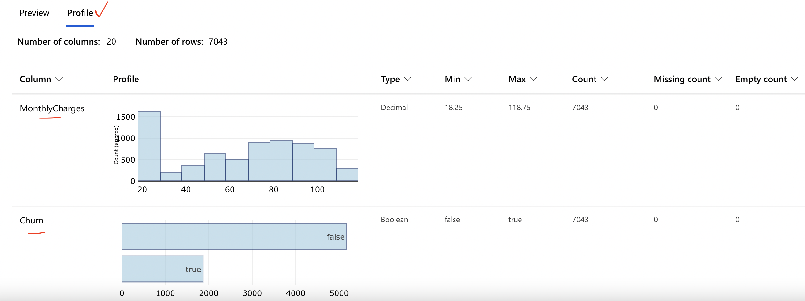

# The Dataset
This dataset captures customer and feature attributes around use of telecom solution, which was sourced from
this [Kaggle
repo](https://www.kaggle.com/blastchar/telco-customer-churn?select=WA_Fn-UseC_-Telco-Customer-Churn.csv). This
is originally sourced as part of IBM samples
[here](https://community.ibm.com/community/user/businessanalytics/blogs/steven-macko/2019/07/11/telco-customer-churn-1113).
The general description reads: *"The Telco customer churn data contains information about a fictional telco
company that provided home phone and Internet services to 7043 customers in California in Q3. It indicates
which customers have left, stayed, or signed up for their service."*

Effectively, this data represents a snapshot in time or the install base of the fictional company at a point
in time. 'Churn' is also a point in time evaluation and is an estimation of the customer engagement at a point
in time. For the purposes of this case study, we assume that once a customer is churned, they do not return.
We also trust that the company adequately has a rigorous process for classifying a customer as 'Churned'.

For the ML model, we will be predicting churn. Note that for many organizations, predicting churn is not an
end goal in itself. Instead, many would prefer to focus on customer retention. For the purposes of this case
study, we assume that predicting churn is a needed step in the process to evaluate and diagnose accurately
where underlying problems may exist, including those that have short-term as well as longer term resolutions.

## Dataset Profile
It is helpful to take advantage of the 'dataset profile' feature available for any dataset uploaded. This is a
feature that can run off the compute instance or cluster to generate a profile of the dataset. This will
identify the datatype, if there are any missing counts, and if a numeric field, a range of values around
percentiles. While trivial to show the same facts in a notebook, the advantage of having this feature embedded
is that it can become part of the data's metadata and be used as yet another way to track lineage including
allow for others to baseline their understanding without running additional code. For example, the snapshot
below highlights how a column like `MonthlyCharges` which is a float field is identified and displayed vs. a
column like `Churn` which is a boolean field. The dataset profile is maintained in the Studio experience
alongside the Dataset details. 

## Attribute Definitions
- **customerID**: A unique ID that identifies each customer.
- **gender**: The customer’s gender: Female,Male
- **SeniorCitizen**: Indicates if the customer is 65 or older: Yes, No
- **Partner**: Indicates if the customer has partner: Yes, No
- **Dependents**: Indicates if the customer lives with any dependents: Yes, No. Dependents could be children,
  parents, grandparents, etc.
- **tenure**: Indicates the total amount of months that the customer has been with the company.
- **PhoneService**: Indicates if the customer subscribes to home phone service with the company: Yes, No
- **Multiple Lines**: Indicates if the customer subscribes to multiple telephone lines with the company: Yes,
  No, No phone service
- **Internet Service**: Indicates if the customer subscribes to Internet service with the company: No, DSL,
  Fiber optic, No
- **Online Security**: Indicates if the customer subscribes to an additional online security service provided
  by the company: Yes, No, No internet service
- **OnlineBackup**: Indicates if the customer subscribes to an additional online backup service provided by
  the company: Yes, No, No internet service
- **DeviceProtection**: Indicates if the customer subscribes to an additional device protection plan for their
  Internet equipment provided by the company: Yes, No, No internet service
- **TechSupport**: Indicates if the customer subscribes to an additional technical support plan from the
  company with reduced wait times: Yes, No, No internet service
- **StreamingTV**: Indicates if the customer uses their Internet service to stream television programing from
  a third party provider: Yes, No, No internet service
- **Streaming Movies**: Indicates if the customer uses their Internet service to stream movies from a third
  party provider: Yes, No, No internet service
- **Contract**: Indicates the customer’s current contract type: Month-to-Month, One Year, Two Year.
- **Paperless Billing**: Indicates if the customer has chosen paperless billing: Yes, No
- **Payment Method**: Indicates how the customer pays their bill: Bank transfer, Credit card, Electronic
  check, Mailed Check
- **Monthly Charge**: Indicates the customer’s current total monthly charge for all their services from the
  company.
- **Total Charges**: Indicates the customer’s total charges, calculated to the end of the quarter specified
  above.
- **Churn**: Yes = the customer left the company this quarter. No = the customer remained with the company.
  Directly related to Churn Value.
