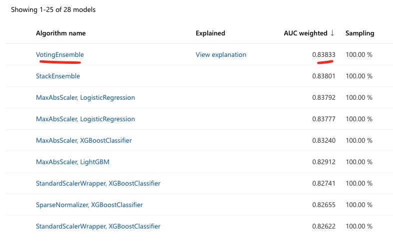
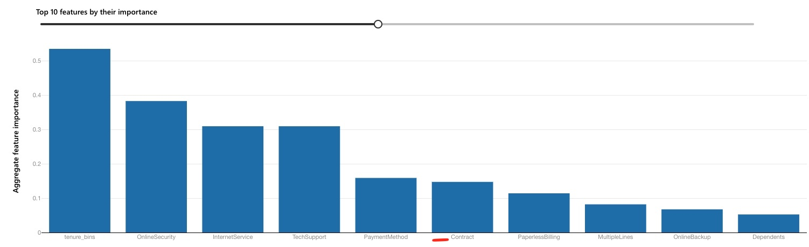
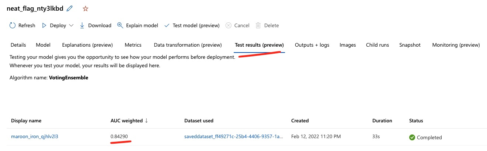
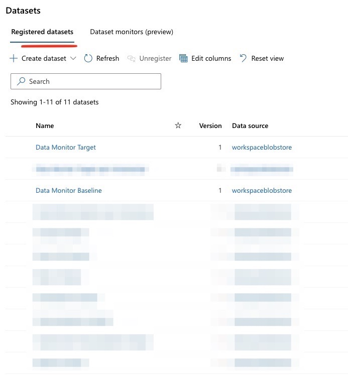
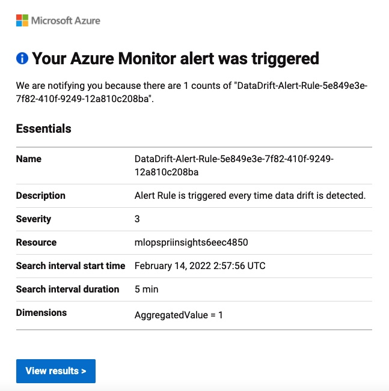
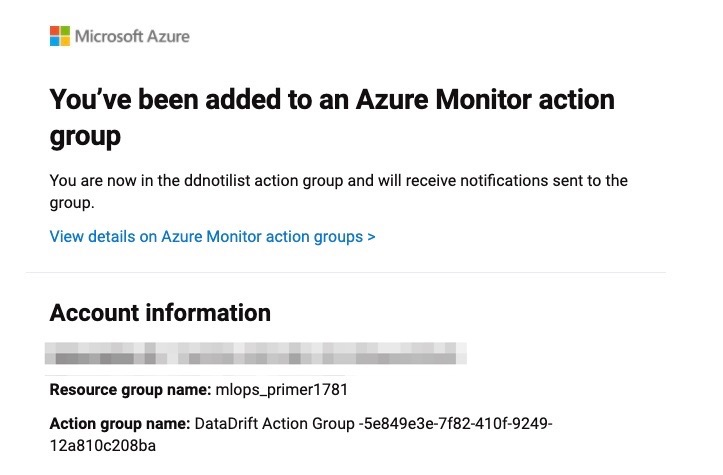
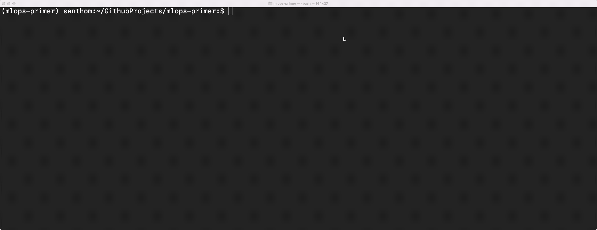

# Data Drift
As a few more months pass, the MLOps team starts to notice the retrained model's accuracy regress. 

On further inspection, they notice that some of the key attributes (including `Contract`, `tenure_bins`, etc.)
are starting to have different distributions. For example, in the `Contract` attribute, 'Month-to-Month'
contracts were almost ~55% of the customer contract preference. However, this is becoming more of an even
spread across month-to-month, 1-year and 2-year contracts. Given the recent pandemic with more people working
from home, the business speculates that more customers are willing to commit to a longer-term plan to lock in
more predictable rates. Telecomm providers are also focusing more efforts on expanding services through
internet services, and are making available better deals on longer-term contracts, with fewer switching
incentives.

As the business continues to learn more, the MLOps team has a more immediate concern. The existing model needs
to reflect these new behaviorial shifts. Attributes like the `Contract` attribute were also one of the primary
features in the baseline/retrained model hence sharper deviations on this attribute may likely cause changes
in the current model's assumptions. 

This is an example of **data drift** - when the original distributions of the attributes used to train the
model start to change. 

In practice, there are a number of methods to detect data drift on input features. As shown later, the Data
Drift Monitor feature in Azure ML helps identify variances in statistics like mean, median, skewness,
kurtosis, etc. in both baseline and target distributions. A more advanced approach may be to employ a
two-sample test like the *Kolmogorov-Smirnov test (KS test)*. This can detect statistical significance
between two distinct populations (in this case, the `Transformed Training Baseline Dataset` and the `Data
Drift Dataset`). Other tests include the *Least-Squares Density Difference* or the *Maximum Mean Discrepancy*
technique. None of the tests mentioned are without its issues. For example, the KS Test can only be used for
one-dimensional data, and so will be limited for highly dimensional data (i.e. most features). While expanding
on the merits of each approach is beyond the scope, do note that a combination of these methods as necessary
for the business use case is recommended.

To respond to data drifts, there are a number of approaches a business can take. In most cases, it involves
retraining. But there are interesting considerations posed on how much of the old and the new dataset to include.
In this case, it could be the case that as time passes and the business responds to some of the
factors that cause customers to churn, a newer dataset would reflect more of the current reality. In other
words, the causes of churn today are different than they were before. In other cases, a larger dataset may be
more advisable to account for new and recurring behaviors. For simplifying the illustration, we will assume
that the new batch offers the most current reality and will be the basis for a new model (i.e. no older data).

Other subtle considerations to note in responding to data drift include:
- **Model degradation.** There may be an acceptable level of degradation implicit in the model that the
  business is willing to assume before retraining. In some industies, the tolerance for drift may be extremely
  low, particularly when a point of drift translates into catastrophic or serious consequences (e.g.
  mis-diagnosis of a terminal illness). As mentioned before, establishing degradation is also a factor of how
  soon the business can establish 'ground truth'.
- **Automation vs. manual intervention.** In general, automation should be strongly encouraged for all
  processes, particularly to keep reinforcing DevOps practices as a foundation for MLOps. In MLOps, this can
  often take the example of automatically triggering a retrain when model performance drops below a certain
  threshold. With new data to account for, and other variables reasonably consistent (e.g. same algorithm,
  same objective/use case), this is a reasonable and recommended approach. In other cases, there may be a need
  to take more manual calls before pushing a new model to production. Retraining of a model may greatly
  simplify getting a new model to production, but if it is not properly understood why certain drifts occur,
  it is worth slowing the process down to better understand this.

## Necessary Steps
1. **Artifact the new batch of data.** The new batch of data (the `Data Drift Dataset`) needs to be registered
   in the workspace. This helps with data lineage and reproducability of results. This dataset contains the
   same attributes, and relative relationship of churn as the `Transformed Training Baseline Dataset`.
   However, as noted above,  a number of attributes are starting to show changes in their spread. More context
   on how this was created is in the *Background Context* section below.
2. **Train the model.** Off the `Data Drift Dataset`, a new training run with AutoML can be triggered to find
   the best model. The AutoML configuration is similar to the retraining step the few months before.
	- Results of the training process yield the following results:
	  
	- After re-training, a number of other features and their importance have rejiggered from their
	  original baseline positions. 
	- Test accuracy is slightly better at ~84% vs. ~82%...
	  

## Data Drift Monitor
One of the ways to keep track of some of these shifts is to periodically run a **dataset monitor** which
specifically compares datasets over time and between different time periods. Setting this up requires some
configuration on the datasets to compare. In this case, both the baseline and the new batch of the `Data
Drift Dataset` are discretely added for comparison, with appropriate timestamps. 

### Viewing Data Drift Results
The studio experience allows an overview of a composite metric for data drift, some level of exploration
of which attributes are driving the data drift, and how they contribute. More customization is possible given
the tight integration with App Insights and Azure Monitor to define reporting and thresholds at even granular
levels. 

For a quick overview of the out-of-box view, see the video below:

### Alerting
One of the benefits of setting up a data drift monitor is its tight integration with Azure Monitor, along with
its alerting capabilities to identify when drift has exceeded a certain threshold.

For example, this is the email notification one receives when a data drift alert is detected.

And this is the email notification which can help define the specific users/group to be part of to be notified
when there is drift detected.

Such alerting mechanisms enable the MLOps team to be proactive with how their data is changing and respond
accordingly. Note that not all data drifts are inherently data relationships changing. Often, there can be
some quality gaps in the attributes coming through the system, and this can be a early signal to mitigate
system issues.

## Comparing the Baseline Model
To see how much the new dataset has degraded on the baseline model, we can compare the `Data Drift Dataset` on
the original `baseline-model-endpoint`. This yields an error rate of +23.6%, compared to the baseline error
rate of ~19-20%. Hence, the inherent drift in the data distributions is leading to this increased
inaccuracy for predictions.

## Background Context
To simulate this scenario, a simulated dataset was created adjusting for a more consistent spread across the
`Contract`, `PaymentMethod`, `Dependents`, `OnlineSecurity`, `TechSupport` and `tenure_bins` attribute in the
baseline dataset. All else was maintained in terms of attribute distributions and overall churn rate compared
to the baseline dataset. More details are in the `modeling` folder of the repo. 
