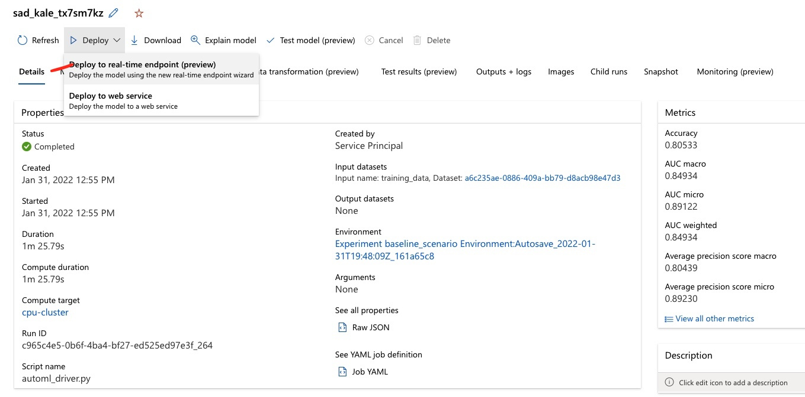
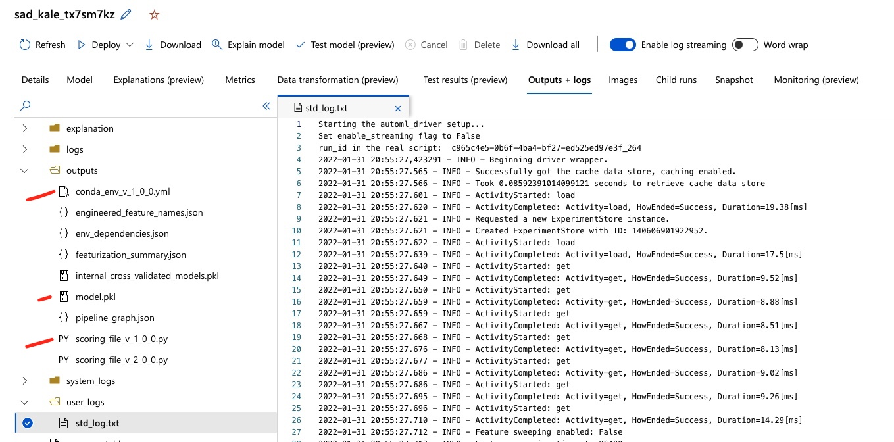
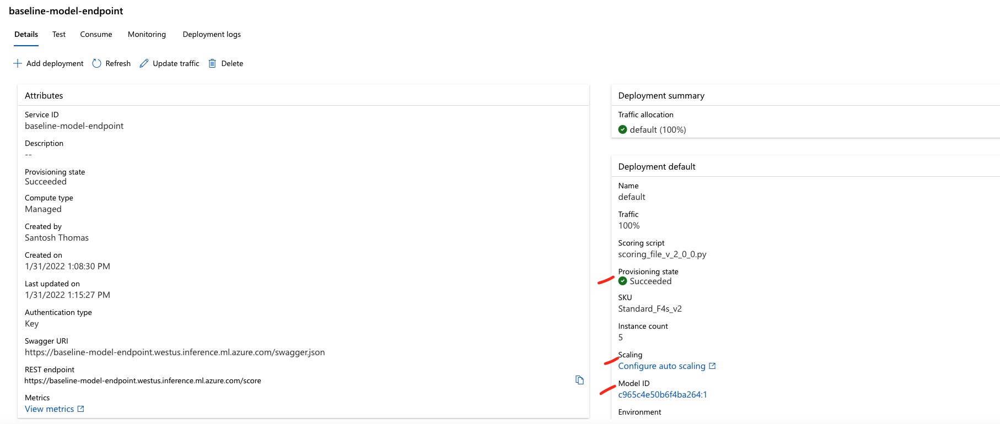

# Model Deployment
XYZ Corporation requires a real-time endpoint to profile new customers as they come in. This provides the
marketing/GTM team an opportunity to assess if there are ways to ensure these customers are more successful,
and retain better. They are aware of multiple methods to deploy a model (a local deployment, through Azure ML
clusters, with Azure Kubernetes Service (AKS), managed endpoints and ACI. All require a model, an environment
with the relevant dependencies, a scoring script (to run the model, and provide the prediction) and a
deployment configuration. Given the need to move fast and manage as minimal infrastucture as possible, they
are interested in leveraging the managed online endpoint.

The easiest approach once a model has been selected is to walk through the wizard option in the studio to
deploy a real-time endpoint. 


Since this flows from the model being evaluated, the scoring script and the dependencies are already part of
the model's outputs and will default as part of the endpoint deployment.


Once deployed, a live endpoint (`baseline-model-endpoint`) is available to receive data inputs and provide a prediction. Note that with
this endpoint, many options are configurable - in particular, auto-scaling to accomodate traffic bursts,
either based upon a manual limit, or a set of metrics.


Using this endpoint with an API key, a script can be easily run to provide predictions. Given the model was
built off an 90/10 split of train/test data, we can push the test data through the API to yield predictions.
This yields a ~80% accuracy by the chosen performance metric. This is reasonably good, compared to the
~84% accuracy on the training set. Note that the trained model preserves the logic for any data
transformations as part of its processing so raw original inputs can be fed into the endpoint.

## Key Requirements to deploy a model
- Online vs. Batch scoring. In this case, we would like a live endpoint as part of our application roll-out
  that can immediately classify the "potential for churn" among the customers signing up to the service.
- Briefly evaluate if you need to deploy through the inferencing in AML, and what other options exist
  (packaging as a Docker container, Flask app etc.)
  
## Specify an inference configuration 
```python
from azureml.core.model import InferenceConfig
from azureml.core.environment import Environment, CondaDependencies
env = Environment.from_pip_requirements(name="onnxruntime_env", file_path='./model_requirements.txt')
env.register(workspace=ws)
inference_config = InferenceConfig(environment=env, source_directory='./source_dir', entry_script='./score_real.py')
```

## Specify a deployment configuration
```python
from azureml.core.webservice import AciWebservice
deployment_config = AciWebservice.deploy_configuration(
    cpu_cores=1, memory_gb=1, auth_enabled=True
)
```

## Deploy the service and retrieve the REST endpoint
```python
service = Model.deploy(
    ws,
    "myservice",
    [model],
    inference_config,
    deployment_config,
    overwrite=True,
)
service.wait_for_deployment(show_output=True)
```
