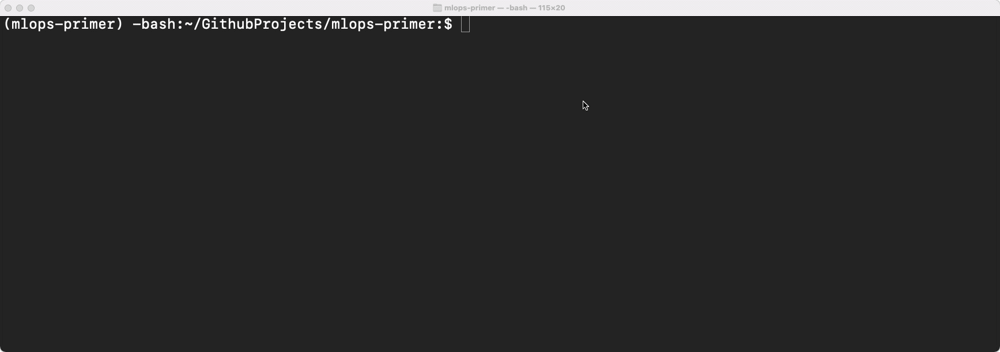

# Next Steps
If you'd like to get started with reproducing some of these insights where getting versed with Azure Machine
Learning, do follow the installation steps below, and learn more at the <repo>.

## Installation Steps
1. Create a virtualized environment and activate it.

2. Install the required python dependencies into this environment. With the included Makefile, once you are in
   the virtualized environment, you can run `make install`.

3. Ensure you have an environment variable file called `sub.env` in your root, with the Azure subscription you
   are using listed in the file as `SUB_ID=<your subscription>`.

4. Run `make setup_run`. This will trigger the creation of the basic Azure Machine Learning setup, followed by
   creation of the cluster, and uploading of the original raw dataset.

5. Create the initial training pipeline run with `make create_pipeline`.

6. To train any of the retrain, data drift or concept drift scenarios, use the following commands:
	- For re-training, `make trigger_retrain`.
	- For data drift, `make trigger_ddrift`.
	- For concept drift, `make trigger_cdrift`.
