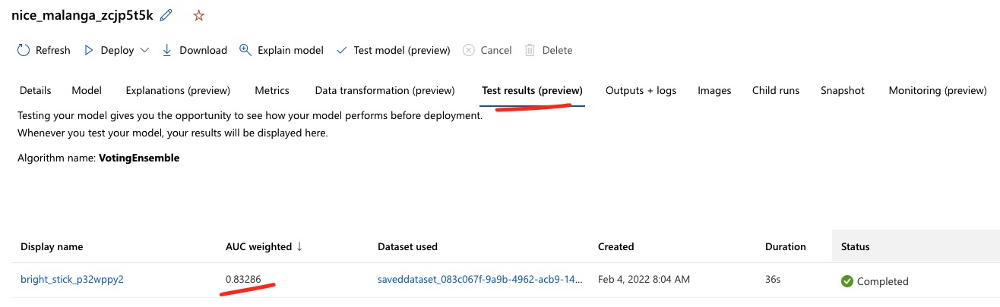

# Three Months Later...
A few months into the use of the churn model, the business is pleased at some of the early outcomes. Though
the churn rate has not dramatically improved, this was expected in the short-term. On the positive side, the
marketing team is aggressively using the model to prioritize outreach and learn customer pain points that
may lead to churn. This is exactly the short-term cultural push the business is looking to make, as they
modernize other processes and systems to enhance the customer experience.

The MLOps team is encouraged by this progress. However, three months have passed since the initial model was
put in operation. No significant degradation has been noticed in model performance. However, by design, the
MLOps team would like to ensure the model in operation is not based on data that is older by three months. As
before, this requires taking the most recent snapshot of customer activity and labeling the 'ground truth' for
which customers have churned (at that point in time, as per the established definition).

To this end, the `Retrain Dataset` is the new dataset which contains the same attributes and a classifiction
for which customers have churned. 

In most scenarios, re-using the original pipeline would be the best practice for training a new model. This
would preserve the data transformations and the reproducibility of the process. However, one can also train
with consistent use of scripts without a pipeline, but preserving data lineage, tracking, and experiment
recreation. To show this flexibility, the new model is triggered through scripts that call the AutoML
configuration to derive the best model. The best model can then be provisioned through a real-time endpoint
(`retrain-endpoint`).

An additional difference in the pipeline approach is that while we explicitly had a step to break out the train and
test split, in this process we specified the 10% of data preserved for a testing run as part of the
configuration. Once the training is done, an automatic testing run is triggered using the best model. Results
are shown below.

## Validating Training
Given that model performance has not degraded significantly, this means that the overall relationship between
customer churn and the underlying attributes has stayed in tact, along with the data distribution being
largely preserved. Moreover, given AutoML's features, they feel the algorithm used will be mostly consistent.
One way to test this would be to:
1. Score the new data (`Retrain Dataset`) on the old model endpoint (`baseline-model-endpoint`). This should
   be close in accuracy.
2. Score the old data (`Transformed Training Baseline Dataset`) on the new model endpoint (`retrain-endpoint`).

Based on the above, they can take a call on whether to keep the existing model in operation, or push a new
model into production. 

## Background Context
To simulate this scenario, a simulated dataset has been created which mimics similar distributions and
input/output relationships from the original dataset. The retraining process should yield a model that is
fairly close in accuracy to the original model. As mentioned in the 'The Business Scenario', establishing
ground truth for a customer that has actually churned is not always straightforward. One can be deterministic
in this approach (for example, saying a customer has churned if they have not used the service for greater
than 30 days), but in some cases, you may know a customer has churned sooner (support calls, bad customer
experience), or in some cases, a customer may return to the service despite having been classified earlier as
churned.
