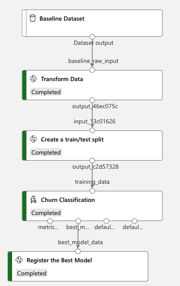
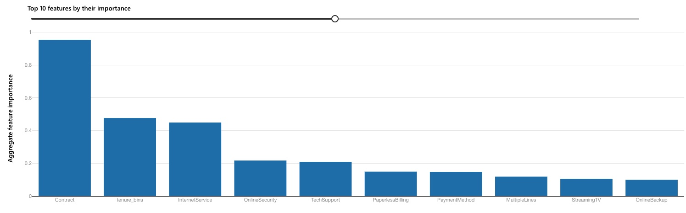

# Model Training
With the growing use of AutoML, the training phase is often the easiest to work through and operationalize.
AutoML has the advantage of not only being user-friendly, but significantly reducing the time to both feature
engineer and evaluate various algorithms against the business problem. We will be taking advantage of Azure
ML's AutoML solution to classify this dataset and predict churn. 

## Creating a pipeline
While it is trivial to leverage the studio experience as part of Azure Machine Learning to train as model to
classify churned customers, we will be leveraging a set of scripts and workflows present
[here](https://github.com/ts-azure-services/mlops-primer/tree/main/scripts/pipeline). Additionally, these
scripts create a formal pipeline for this process. A pipeline is particularly helpful when one
wants to standardize a repeatable process. Often, before training, one would need to marry multiple data inputs, do
some amount of data cleaning and transformation and then have processes after training to register datasets
and models in the system. Keeping this consistent between training runs is critical.

### Model Stages
1. `Baseline Dataset` - this is the raw dataset that is uploaded into the system.
2. `Transform Data` - this is small python script to add bin functions for the `MonthlyCharges` and the
   `Tenure` column.
3. `Create a train/test split` - this step in the pipeline breaks out the transformed dataset into a
   train/test split of 0.9/0.1.
4. `Churn Classification` - this step is the most time-consuming step and takes the training data as input and
   automatically runs through both feature engineering and training. In the Studio experience, double-clicking
   on this step yields the models generated, and their respective details.
5. `Register the Best Model` - this final step registers the best model in the `Models` section.

Registration of artifacts through the training process is also a best practice to ensure lineage of data, and reproducability of the
workflow.

## Model Results & Selection
With AutoML, a range of different feature engineering and algorithms are considered and ranked based upon the
performance metric selected. A final "VotingEnsemble" model will then run to combine the benefits of multiple
models. This will typically ensure the highest accuracy as shown below.

## Top Features 
As a part of AutoML's process, the final "VotingEnsemble" model will also produce an "explanations" run to
highlight a number of aspects, including which features were most predictive of the target variable, i.e.
Churn. The results are shown below.

## Key Metrics
With any child run and model produced, a host of charts and metrics are produced which enable evaluation and
selection of an accurate model. A few that generate automatically from the system are shown below:

### Precision Recall 

### ROC curve

### Calibration Curve

### Lift Curve

### Cumulative Gains Curve

#### Pending
- Another way to trigger a model can be using Functions.
