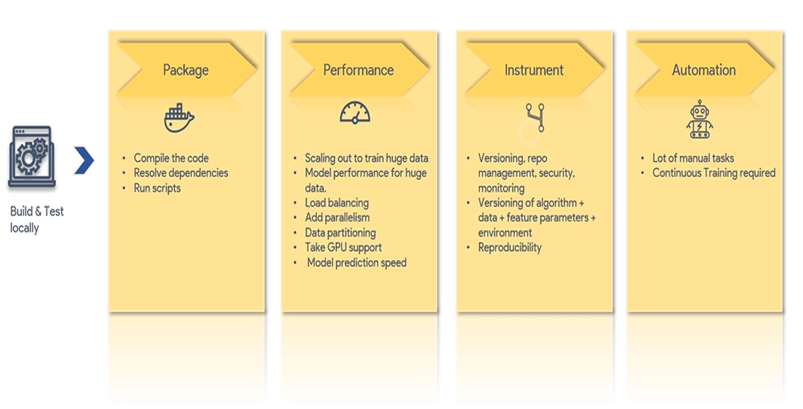

# The MLOps Process
**show example**
- Define what MLOps is, and what it is not.

- Unlike traditional software where a fairly deterministic set of requirements is pushed out and then required
  to be supported, the operationalization of ML requires continuous evaluation of when to retrain the model,
  whether simpler algorithms and approaches should be taken, and how to ensure better models are seamlessly
  managed to the end user.

- Above all, it is a set of iterative practices to automate, build, and continuously achieve business
  objectives through machine learning.

